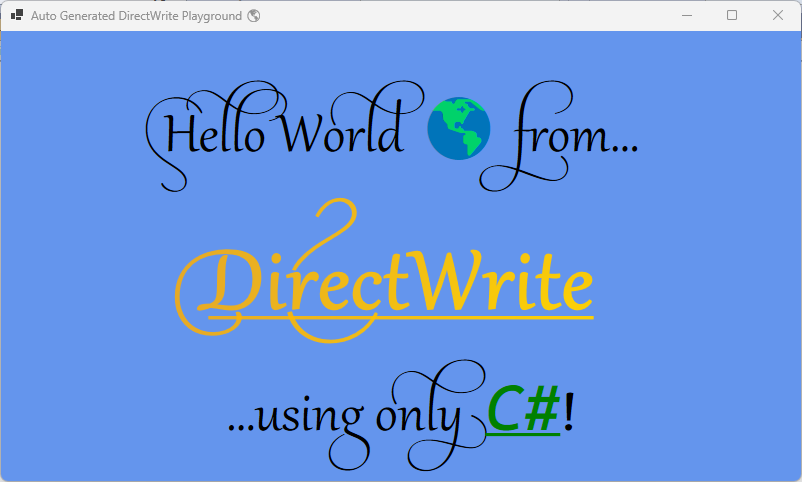

# Auto-gen Direct Write Playground

This is an experiment investigating using the awesome [CsWin32](https://github.com/microsoft/CsWin32) [Nuget package](https://www.nuget.org/packages/Microsoft.Windows.CsWin32) to draw to a Windows Forms form using Direct Write through a GDI DC.  

While CsWin32 is a huge help with generating PInvoke boilerplate, it is still in Beta, so it has a few bugs to work out and some things to work around.  

To get Direct Write to work the following interfaces have had to be overridden from what CsWin32 generates because of a couple of methods that currently don't work as generated:  

- `ID2D1BitmapRenderTarget`
- `ID2D1DCRenderTarget`
- `ID2D1DeviceContext`
- `ID2D1DeviceContext1`
- `ID2D1DeviceContext2`
- `ID2D1DeviceContext3`
- `ID2D1DeviceContext4`
- `ID2D1DeviceContext5`
- `ID2D1DeviceContext6`
- `ID2D1HwndRenderTarget`
- `ID2D1RenderTarget`

Specifically the `GetSize` and `GetPixelSize` methods both crash because they are generated to return their respective structs rather than an `HRESULT`. See [CsWin32 Issue #167](https://github.com/microsoft/CsWin32/issues/167) on incorrect generation. When the `GetSize` and `GetPixelSize` methods aren't called, it still manifests as memory corruption in later calls because the returned structs in the interfaces are not the same size as the `HRESULT` and struct. For example calling `textLayout = DirectWriteFactory?.CreateTextLayout(text, textFormat, renderTarget?.GetSize() ?? default);` results in:  

> [!ERROR]  
> System.AccessViolationException: 'Attempted to read or write protected memory. This is often an indication that other memory is corrupt.'  

To see the results of CsWin32 generated PInvokes, exclude the `Overrides` folder in the `AutoGenDirectWriteLibrary` project and compile.  
